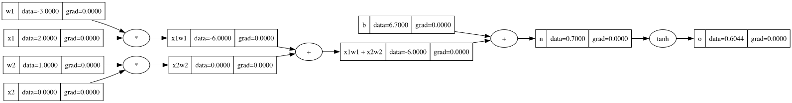
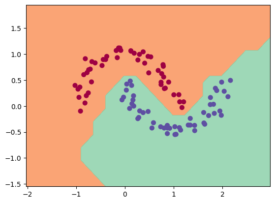

# micrograd

[](https://www.python.org/downloads/release/python-3100/)
[](LICENSE)

A lightweight autograd engine and scalar-valued neural network library built from scratch for educational purposes, inspired by Andrej Karpathy's [micrograd](https://github.com/karpathy/micrograd).

`micrograd` implements backpropagation over a dynamically built Directed Acyclic Graph (DAG) and provides a PyTorch-like API for constructing Multi-Layer Perceptrons (MLPs).

## Environment Setup

Create and activate the conda environment:
```bash
conda env create -f environment.yml
conda activate micrograd
```

Build micrograd package:
```bash
pip install -e .
```

## Example Usage
Below is a basic example showing a number of possible supported operations:

```python
from micrograd.engine import Value

# Define scalar inputs
a = Value(-4.0)
b = Value(2.0)

c = a + b
d = a * b + b**3
c += c + 1
c += 1 + c + (-a)
d += d * 2 + (b + a).relu()
d += 3 * d + (b - a).relu()
e = c - d
f = e**2
g = f / 2.0
g += 10.0 / f

print(f"Forward outcome (g.data): {g.data:.4f}")  # Outputs 24.7041

# Backpropagate through the graph
g.backward()

print(f"Gradient dg/da: {a.grad:.4f}")  # Outputs 138.8338
print(f"Gradient dg/db: {b.grad:.4f}")  # Outputs 645.5773
```

The autograd engine dynamically constructs a Directed Acyclic Graph (DAG) during the forward pass to track operations and backpropagate gradients:
```python
# Creating a small neural network

# inputs
x1 = Value(2.0, label='x1')
x2 = Value(0.0, label='x2')
# weights
w1 = Value(-3.0, label='w1')
w2 = Value(1.0, label='w2')
# bias
b = Value(6.7, label='b')

# network
x1w1 = x1 * w1; x1w1.label = 'x1w1'
x2w2 = x2 * w2; x2w2.label = 'x2w2'
x1w1x2w2 = x1w1 + x2w2; x1w1x2w2.label = 'x1w1 + x2w2'
n = x1w1x2w2 + b; n.label = 'n'
o = n.tanh(); o.label = 'o'

draw_dot(o)
```

Below is an example of the computational graph:



## Notebooks & Learning Progress

During development, I followed Andrej Karpathy's [video tutorial](https://youtu.be/VMj-3S1tku0?si=DhD3Qg8oP3I0n4O0) and practiced all core concepts step-by-step in Jupyter notebooks. You can view all progress and experimentation in the [notebooks](notebooks) directory.

## Training a Neural Network

The notebook [p5_demo.ipynb](notebooks/p5_demo.ipynb) provides a full demo of training a 2-layer neural network (MLP) binary classifier. This is achieved by initializing a neural net from micrograd.nn module, implementing a simple svm "max-margin" binary classification loss and using SGD for optimization. As shown in the notebook, using a 2-layer neural net with two 16-node hidden layers we achieve the following decision boundary on the moon dataset:



## Running Tests

To run the unit tests you will have to install PyTorch, which the tests use as a reference for verifying the correctness of the calculated gradients. Then simply:
```bash
python -m pytest
```


## Licence

This project is licensed under the MIT License - see the [LICENSE](LICENSE) file for details.

